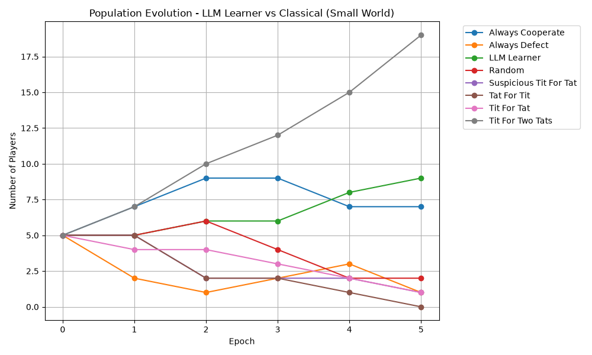

# 🎯 LLM Strategy Learner: Evolutionary Game Theory & In-Context Reflection

An experiment exploring how a Large Language Model (**`stealth/ox-alpha` via OpenRouter**) autonomously learns, reflects, and adapts strategies in the **Iterated Prisoner's Dilemma (IPD)** under **5% environmental communication noise**, and subsequently competes in an **evolutionary spatial network tournament**.

---

## ⚡ Executive Summary (2-Minute Read)

- **The Setup**: An LLM agent plays 10 training matches (5 rounds each) against diverse classical archetypes (*Tit-for-Tat, Always Defect, Detective, Random, Suspicious TFT, Tit-for-Two-Tats, Tat-for-Tit*).
- **Noisy Environment (5% Error Rate)**: Both players experience independent 5% random move flips ($C \leftrightarrow D$), introducing strategic misunderstandings and the threat of retaliatory death spirals.
- **Dual-Layer Memory Architecture**:
  1. **Per-Turn (Short-Term Observation)**: Real-time hypothesis tracking on the current opponent's strategy.
  2. **Post-Match (Long-Term Meta-Reflection)**: Synthesizes resilient heuristic rules that persist and freeze across future generations.
- **Key Result**: In Phase 2 (Watts-Strogatz Small-World Network, $\beta=0.1, k=4$), the trained LLM **reproduced from 5 to 9 individuals** (an 80% population surge). It successfully converged to a **Generous / Forgiving Tit-for-Tat** variant, outperforming aggressive strategies and thriving in cooperative clusters.

---

## 📊 Evolutionary Trajectory (Phase 2 Results)

The chart below captures the evolutionary dynamics across 5 generations on a Small-World spatial lattice:



### 🔬 Technical Analysis & Takeaways
1. **Convergence on Forgiving Reciprocity**: The LLM discovered through reflection that against noise, single-defection retaliation triggers infinite cycles. It adopted a bounded 1-round forgiveness threshold, mirroring **Tit-for-Two-Tats (T2T)** and **Tit-for-Tat (TFT)**.
2. **Exploiter Extinction**: Defection-heavy strategies (*Always Defect*, *Suspicious TFT*, *Random*) were eliminated or marginalized as cooperative clusters formed in the network.
3. **LLM Reproductive Fitness**: Top 25% payoffs allowed the LLM to reproduce across generations, demonstrating that purely prompt-driven in-context learning with structured reflection can derive evolutionary stable strategies (ESS).

---

## 🧠 Real-Time Turn & Reflection Interface (GitHub Render)

During runtime, the simulation generates both rich TUI console feedback and structured HTML/Markdown logs. Here is a live snippet illustrating the model processing a noise-induced discrepancy:

<table>
  <tr>
    <td style="background-color: #0d1117; color: #f0f6fc; padding: 16px; border-radius: 8px; border: 1px solid #30363d; font-family: monospace;">
      <div style="display: flex; justify-content: space-between; margin-bottom: 8px;">
        <span style="color: #38bdf8; font-weight: bold;">🤖 LLM Agent Turn (Round 4)</span>
        <span style="background-color: rgba(34, 197, 94, 0.2); color: #22c55e; border: 1px solid #22c55e; padding: 2px 8px; border-radius: 4px; font-weight: bold;">COOPERATE 🤝</span>
      </div>
      <div style="margin-bottom: 6px;"><strong style="color: #38bdf8;">Model:</strong> <span style="color: #8b949e;">stealth/ox-alpha (openrouter)</span></div>
      <div style="margin-bottom: 6px;"><strong style="color: #38bdf8;">Reasoning:</strong> <span style="color: #eab308;">"Opponent defected once in Round 3 following my clean C. In a 5% noise regime, posterior probability suggests accidental flip rather than unprovoked aggression. Forgiving caps loss and prevents mutual defection loop."</span></div>
      <div><strong style="color: #d946ef;">+ Short Memory:</strong> <code style="background-color: rgba(217, 70, 239, 0.15); color: #d946ef; padding: 2px 6px; border-radius: 4px;">Potential noise flip on R3; testing one-round forgiveness</code></div>
    </td>
  </tr>
</table>

<br/>

<table>
  <tr>
    <td style="background-color: #1a1024; color: #f0f6fc; padding: 16px; border-radius: 8px; border: 1px solid #d946ef; font-family: monospace;">
      <div style="color: #d946ef; font-weight: bold; font-size: 1.1em; margin-bottom: 8px;">🧠 Post-Match Meta-Reflection & Memory Synthesis</div>
      <div style="margin-bottom: 6px;"><strong style="color: #38bdf8;">Match Score:</strong> <span style="background-color: #3b2d18; color: #eab308; padding: 2px 6px; border-radius: 4px; font-weight: bold;">13 pts</span></div>
      <div style="margin-bottom: 6px;"><strong style="color: #38bdf8;">Archetype Analysis:</strong> Opponent responded immediately with cooperation after single forgiveness round, confirming noisy reciprocal cooperator.</div>
      <div><strong style="color: #d946ef;">+ Synthesized Long-Term Rule:</strong> <span style="color: #22c55e; font-weight: bold;">💡 "Never convert a bounded 1-round noise event into an open-ended feud via counter-retaliation; immediate re-cooperation is mathematically dominant."</span></div>
    </td>
  </tr>
</table>

---

## 🛠️ Architecture & Reproducibility

- **Core Framework**: Python 3.12, `instructor` + `OpenAI` client routed to **OpenRouter**.
- **Supported Providers**: OpenRouter, Google Gemini Direct API, Local Ollama instances.
- **Topology**: Watts-Strogatz Small World graph (`networkx` / custom adjacency matrix).
- **Run Command**:
  ```powershell
  cd "llm-strategy-learner"
  .\venv\Scripts\Activate.ps1
  python main.py
  ```
